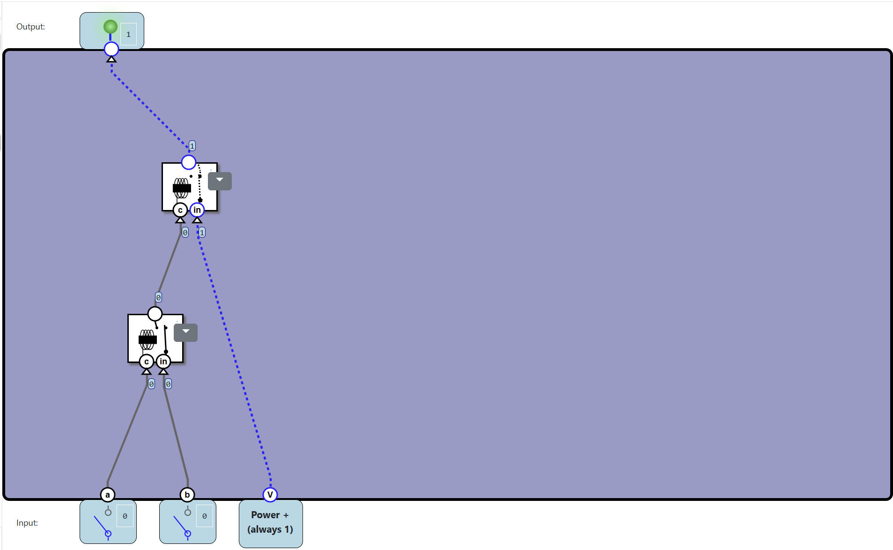
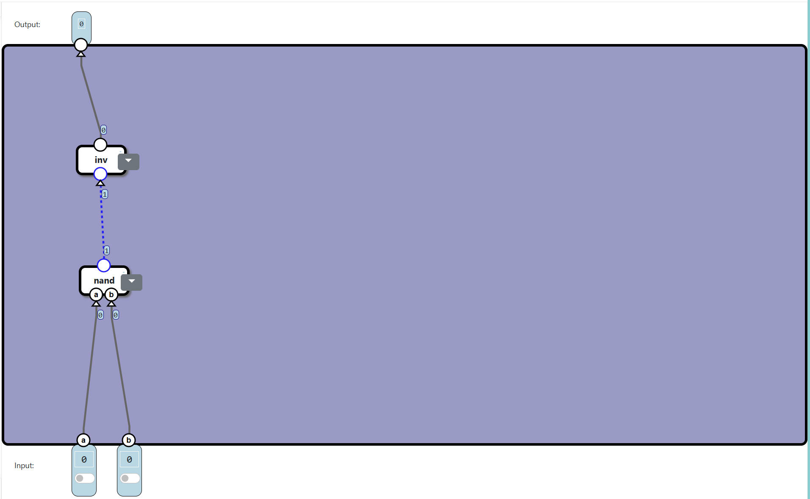
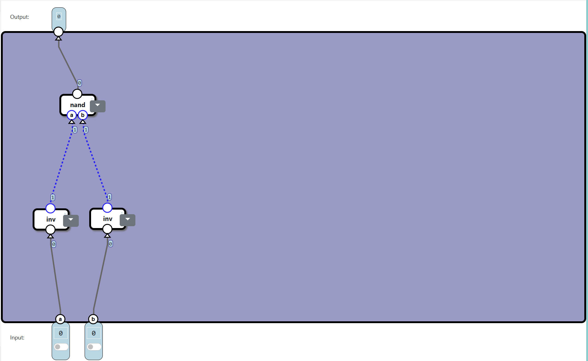
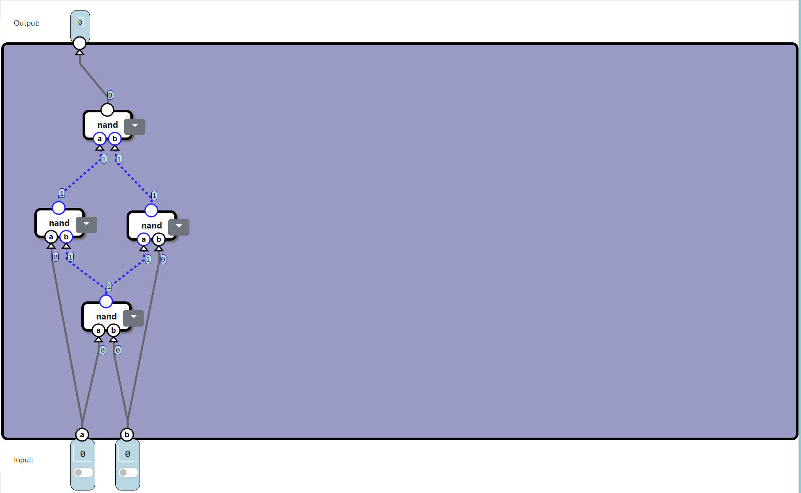
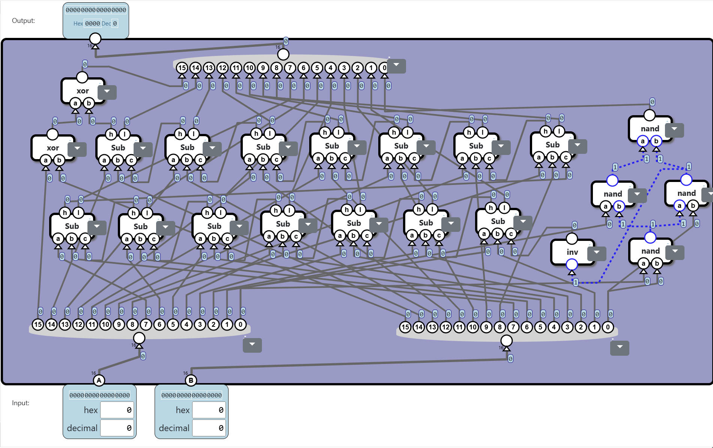

> 前言：
>
> Nandgame 前端界面在 2025 年经历了一次彻底翻新：
>
> - Computer 对应旧版的 Hardware 。
> - Assembler ~ High-level language 对应旧版的 Software 。
> - Transistor level ~ Multitasking CPU 对应旧版的 Optional Levels 。
>
> 本文大部分关卡用与非门数量最少作为标准，在此基础上尽可能追求简洁。如果读者有更优解法，欢迎在评论区留言。
>
> 除了给出最终解法外，希望读者能看懂得到最优解的推理过程，知其然知其所以然！
>
> 参考资料：
>
> - 最优解统计：<https://github.com/speedydelete/nandgame> 。

## Logic Gates

### Nand

#### 任务

使用电磁继电器做出与非门元件。

| $a$  | $b$  | $\text{a nand b}$ |
| :--: | :--: | :---------------: |
|  0   |  0   |         1         |
|  0   |  1   |         1         |
|  1   |  0   |         1         |
|  1   |  1   |         0         |

#### 分析

默认断开的电磁继电器可以计算 $\text{a and b}$ ，配合默认闭合的电磁继电器以及电源实现取反。

### Invert

#### 任务

输入 $a$ ，输出 $\text{inv a}$  。

| $a$  | $\text{inv a}$ |
| :--: | :------------: |
|  0   |       1        |
|  1   |       0        |

#### 分析

$a\text{ nand a}=\text{inv a}$ ，合计 $1$ 个元件、 $1$ 个与非门。

### And

#### 任务

输入 $a,b$ ，输出 $\text{a and b}$ 。

| $a$  | $b$  | $\text{a and b}$ |
| :--: | :--: | :--------------: |
|  0   |  0   |        0         |
|  0   |  1   |        0         |
|  1   |  0   |        0         |
|  1   |  1   |        1         |

#### 分析

$\text{a and b = inv(a nand b)}$ ，合计 $2$ 个元件、 $2$ 个与非门。

### Or

#### 任务

输入 $a,b$ ，输出 $\text{a or b}$ 。

| $a$  | $b$  | $\text{a or b}$ |
| :--: | :--: | :-------------: |
|  0   |  0   |        0        |
|  0   |  1   |        1        |
|  1   |  0   |        1        |
|  1   |  1   |        1        |

#### 分析

$\text{a or b = (inv a) nand (inv b)}$ ，合计 $3$ 个元件、 $3$ 个与非门。

### Xor

#### 任务

输入 $a,b$ ，输出 $\text{a xor b}$ 。

| $a$  | $b$  | $a\text{ xor }b$ |
| :--: | :--: | :--------------: |
|  0   |  0   |        0         |
|  0   |  1   |        1         |
|  1   |  0   |        1         |
|  1   |  1   |        0         |

#### 分析

常规做法 $\text{a xor b = (a nand b) and (a or b)}$ ，但是需要 $6$ 个与非门，不够优。

下图做法需要 $4$ 个元件、 $4$ 个与非门，但是笔者没想到很好的解释方法，可以当做定式记下来。

## Arithmetics

### Half Adder

#### 任务

输入 $a,b$ ，输出 $2$ 个比特分别表示 $a+b$ 的高位和低位。

| $a$  | $b$  | $h$  | $l$  |
| :--: | :--: | :--: | :--: |
|  0   |  0   |  0   |  0   |
|  0   |  1   |  0   |  1   |
|  1   |  0   |  0   |  1   |
|  1   |  1   |  1   |  0   |

#### 分析

$\text{h = a and b, l = a xor b}$ ，将 $\text{and}$ 和 $\text{xor}$ 展开后可以发现有一个 $\text{nand}$ 元件被共用，可以省去。合计 $5$ 个元件、 $5$ 个与非门。

### Full Adder

#### 任务

输入 $a,b,c$ ，输出 $2$ 个比特分别表示 $a+b+c$ 的低位和高位。

| $a$  | $b$  | $c$  | $h$  | $l$  |
| :--: | :--: | :--: | :--: | :--: |
|  0   |  0   |  0   |  0   |  0   |
|  0   |  0   |  1   |  0   |  1   |
|  0   |  1   |  0   |  0   |  1   |
|  0   |  1   |  1   |  1   |  0   |
|  1   |  0   |  0   |  0   |  1   |
|  1   |  0   |  1   |  1   |  0   |
|  1   |  1   |  0   |  1   |  0   |
|  1   |  1   |  1   |  1   |  1   |

#### 分析

首先容易想到连续使用两次半加器的做法，如下图，合计 $3$ 个元件、 $13$ 个与非门。

将所有元件展开后消去相邻的 $\text{inv}$ 即可得到最优解，合计 $9$ 个元件、 $9$ 个与非门。

### Multi-bit Adder

#### 任务

给定低位 $a_0,b_0$ 、高位 $a_1,b_1$ 和进位（属于低位） $c$ ，输出和的低位 $s_0$ 、高位 $s_1$ 以及给下一位的进位 $c$ 。

#### 分析

使用 $2$ 个全加器即可，合计 $2$ 个元件、 $18$ 个与非门。

### Increment

#### 任务

给定 $16$ 位二进制数 $a$ ，输出 $a+1$ 。

#### 分析

##### 解法一

通过 $\text{inv 0}$ 得到 $1$ ，将其与 $a$ 相加即可，合计 $2$ 个元件、 $145$ 个与非门。

##### 解法二

> 前置知识：通过 Custom Components 创建你需要的元件，它会自动加入你的 toolbox ，并且可以在闯关时调用。
>
> 为引入 bundler 和 splitter 元件，你可以先在 Custom Components 中创建对应元件，再在闯关界面内点击 "Replace with parts" 。

由于 $B=1$ ，所以进位时只涉及到两个数相加，半加器足以胜任。

将 $A$ 的 $16$ 位展开，最低位输出 $\text{inv }a_0$ ，进位为 $a_0$ ，中间使用 $14$ 个半加器，最高位用 $\text{xor}$ 代替半加器即可。合计 $16$ 个元件、 $75$ 个与非门。

### Subtraction

#### 任务

给定 $16$ 位无符号二进制数 $a,b$ ，输出 $16$ 位**无符号**二进制数 $a-b$ 。

#### 分析

##### 解法一

众所周知 `-b=(~b)+1` ，于是容易想到用 $a$ 加上 $b$ 的补码再自增一次。

但是有一个巧招，将 $\text{inv(0)}$ 作为进位传给全加器，从而达到自增目的且避开了自增器。合计 $3$ 个元件、 $161$ 个与非门。

##### 解法二

仿照全加器的思路，我们可以制作一个全减器：输入 $a,b,c$ ，输出 $a-b-c$ 以及高位是否需要退位：

由于最低位 $c=0$ ，所以只需要 $5$ 个与非门；由于最高位不关心退位，所以只需要 $8$ 个与非门。

合计 $5+9\times 14+8=139$ 个与非门。

### Equal to Zero

#### 任务

输入 $b_0,b_1,b_2,b_3$ ，判断是否全为 $0$ 。

#### 分析

$3$ 次 $\text{or}$ 操作然后取反，合计 $4$ 个元件、 $10$ 个与非门。

### Less than Zero

#### 任务

给定 $16$ 位有符号整数 $a$ ，输出 $[a\lt 0]$ 。

#### 分析

最高位（第 $15$ 位）为符号位，输出该位数字即可，合计 $0$ 个元件、 $0$ 个与非门。

## Switching

### Selector

#### 任务

给定 $s,d_0,d_1$ ，如果 $s=0$ 则输出 $d_0$ ，否则输出 $d_1$ 。

#### 分析

$ans=\text{(inv(s) and d\_0) or (s and d\_1)}$ ，展开后消去相邻的 $\text{inv}$ ，合计 $4$ 个元件、 $4$ 个与非门。

### Switch

#### 任务

给定 $s,d$ ，如果 $s=0$ 则输出 $c_0=d$ ，否则输出 $c_1=d$ 。

#### 分析

$c_0=\text{inv(s) and d},c_1=\text{s and d}$ ，将 $c_1$ 所用 $\text{and}$ 展开，注意到 $\text{inv(s) and d=inv(s and d) and d}$ ，因此可以把 $c_0$ 所用 $\text{and}$ 的一个接口从 $\text{inv(s)}$ 改为 $\text{s nand d}$ 。合计 $3$ 个元件、 $4$ 个与非门。

