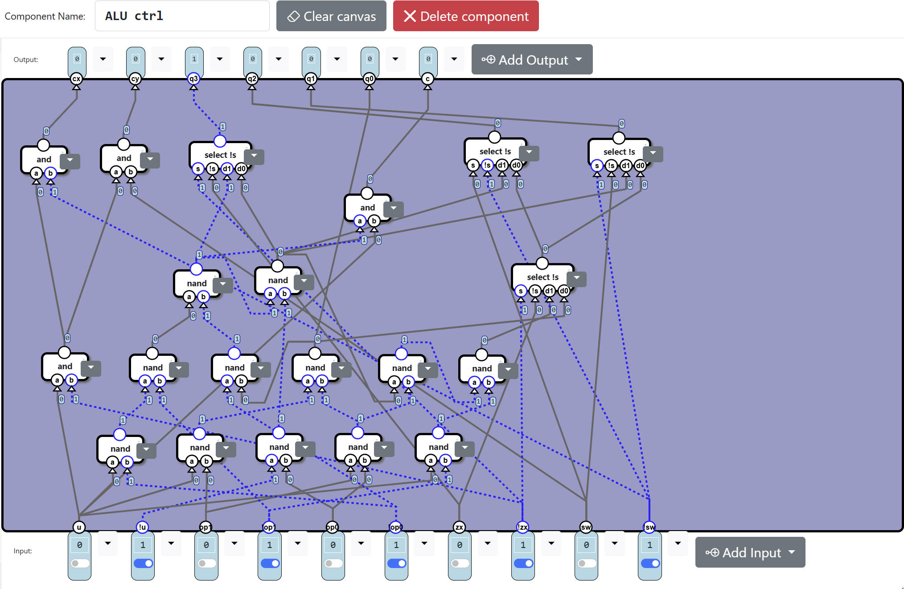
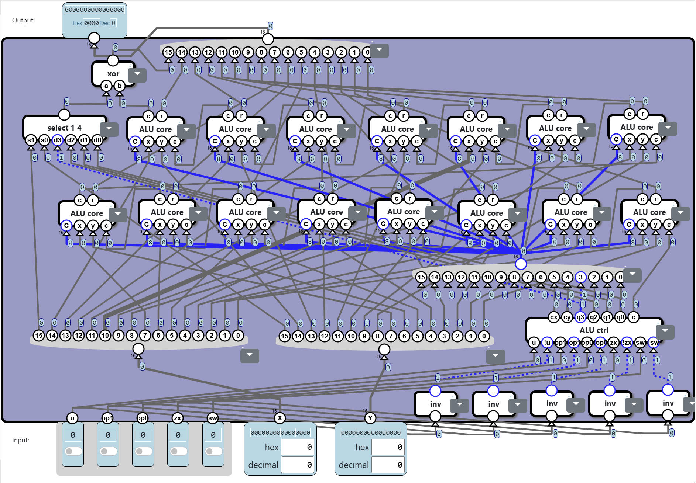
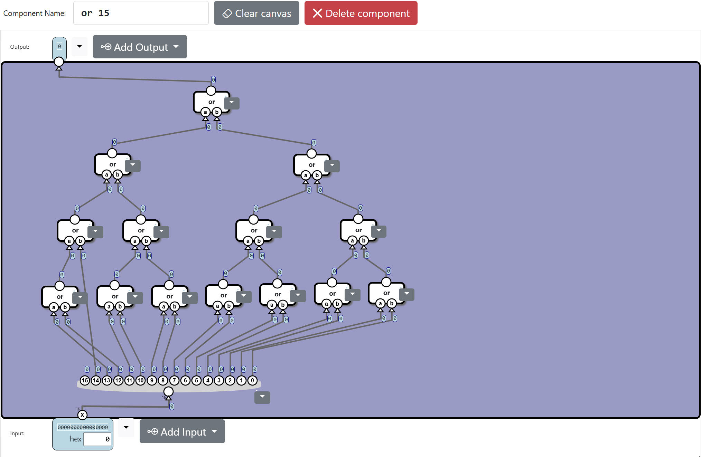
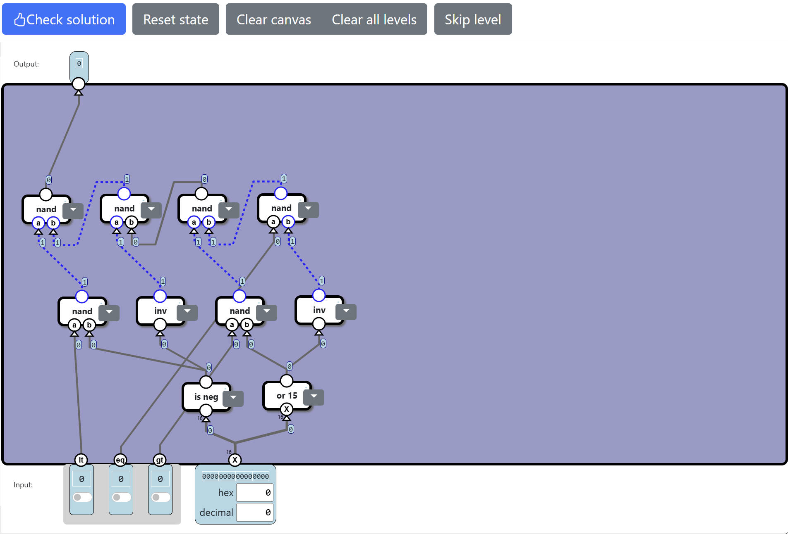

## Arithmetic Logic Unit

### Logic Unit

#### 任务

给定 $op_1,op_0$ 和 $16$ 位二进制数 $x,y$ ，输出如下：

| $op_1$ | $op_0$ |     $output$     |
| :----: | :----: | :--------------: |
|   0    |   0    | $\text{x and y}$ |
|   0    |   1    | $\text{x or y}$  |
|   1    |   0    | $\text{x xor y}$ |
|   1    |   1    |  $\text{inv x}$  |

#### 分析

##### 解法一

直接模拟，合计 $7$ 个元件、 $352$ 个与非门。

##### 解法二

用 $4$ 个控制元件和 $9$ 个计算元件即可实现一位的操作，合计 $4+9\times 16=148$ 个与非门。

### Arithmetic Unit

#### 任务

给定 $op_1,op_0$ 和 $16$ 位二进制数 $x,y$ ，输出如下：

| $op_1$ | $op_0$ | $output$ |
| :----: | :----: | :------: |
|   0    |   0    |  $x+y$   |
|   0    |   1    |  $x+1$   |
|   1    |   0    |  $x-y$   |
|   1    |   1    |  $x-1$   |

#### 分析

##### 解法一

先用 $op_0$ 选择 $y$ 和 $1$ ，再用 $op_1$ 选择加法和减法，合计 $5$ 个元件、 $412$ 个与非门。

##### 解法二

| $op_1$ | $op_0$ | $op_1\oplus op_0$ | AU core  | $output$ |      变形      |
| :----: | :----: | :---------------: | :------: | :------: | :------------: |
|   0    |   0    |         0         |   $y$    |  $x+y$   |     $x+y$      |
|   0    |   1    |         1         |   $0$    |  $x+1$   |   $(x+0)+1$    |
|   1    |   0    |         1         | $\sim y$ |  $x-y$   | $(x+\sim y)+1$ |
|   1    |   1    |         0         | $65535$  |  $x-1$   |   $x+65535$    |

我们需要一个能输出 $(y,0,\sim y,1)$ 的 AU core 元件，刚好在以 $op_1$ 和 $op_1\oplus op_0$ 为输入时只需要 $4$ 个与非门就可以做到，如下图：

最后实现一个带进位的 $16$ 位加法器即可，这一部分需要 $8+15\cdot 9=143$ 个与非门，如下图：

合计 $4+64+143=211$ 个与非门。

### ALU

#### 任务

给定 $u,op_0,op_1,zx,sw$ 和 $16$ 位二进制数 $x,y$ 。

- 如果 $sw=1$ ，交换 $x,y$ 。
- 如果 $zx=1$ ，令（执行完上条命令后的） $x=0$ 。

此后输出如下：

| $u$  | $op_1$ | $op_0$ |     $output$     |
| :--: | :----: | :----: | :--------------: |
|  0   |   0    |   0    | $\text{x and y}$ |
|  0   |   0    |   1    | $\text{x or y}$  |
|  0   |   1    |   0    | $\text{x xor y}$ |
|  0   |   1    |   1    |  $\text{inv x}$  |
|  1   |   0    |   0    |      $x+y$       |
|  1   |   0    |   1    |      $x+1$       |
|  1   |   1    |   0    |      $x-y$       |
|  1   |   1    |   1    |      $x-1$       |

#### 分析

##### 解法一

用 $sw$ 过两次选择器得到新的 $x,y$ ，再用 $zx$ 过一次选择器选择 $x$ 和 $0$ ，最后用 $s$ 选择算术单元和逻辑单元。合计 $6$ 个元件、 $615$ 个与非门。

##### 解法二

如果我们同时有 s 和 !s 接口，那么可以用 $3$ 个与非门实现选择器。

基于此可以用 11 个与非门设计 4 选 1 的元件。

------

接下来设计解码器 ALU ctrl 元件。

将 $x-y$ 看成 $x+\sim y+1$ ， $x-1$ 看成 $x+65535$ ，进位 $c=\text{u and (op1 xor op0)}$ 。

用 $q3,q2,q1,q0$ 分别表示 $(x,y)=(1,1),(1,0),(0,1),(0,0)$ 时该位的答案。

|  u   | op1  | op0  |        -         | $q3'$ | $q2'$ | $q1'$ | $q0'$ |
| :--: | :--: | :--: | :--------------: | :---: | :---: | :---: | :---: |
|  0   |  0   |  0   | $\text{x and y}$ |   1   |   0   |   0   |   0   |
|  0   |  0   |  1   | $\text{x or y}$  |   1   |   1   |   1   |   0   |
|  0   |  1   |  0   | $\text{x xor y}$ |   0   |   1   |   1   |   0   |
|  0   |  1   |  1   |  $\text{inv x}$  |   0   |   0   |   1   |   1   |
|  1   |  0   |  0   |      $x+y$       |   0   |   1   |   1   |   0   |
|  1   |  0   |  1   |       $x$        |   1   |   1   |   0   |   0   |
|  1   |  1   |  0   |    $x+\sim y$    |   1   |   0   |   0   |   1   |
|  1   |  1   |  1   |      $x+1$       |   0   |   0   |   1   |   1   |

令 $\text{cx = u and !zx and !sw, cy=u and !zx and sw}$ 用于处理进位，后面会解释。

| 编号 |   类型    |     输入     | 关于 (u,op1,op0) 真值表 |
| :--: | :-------: | :----------: | :---------------------: |
|  1   |   nand    |    u,!op0    |        11110101         |
|  2   |   nand    |    u,op1     |        11111100         |
|  3   |   nand    |    !u,op0    |        10101111         |
|  4   |   nand    |   op1,op0    |        11101110         |
|  5   |   nand    |    u,!op1    |        11110011         |
|  6   |    and    |    u,!zx     |            -            |
|  7   |   nand    |    1,!op1    |        00111011         |
|  8   |   nand    |    !op0,9    |        11111101         |
|  9   |   nand    |     2,4      |      **00010011**       |
|  10  |   nand    |     13,4     |        10010111         |
|  11  |   nand    |     10,5     |      **01101100**       |
|  12  |   nand    |     7,8      |      **11000110**       |
|  13  |   nand    |     12,3     |      **01111001**       |
|  14  | select !s | !zx,zx,11,9  |            -            |
|  15  |    and    |     12,u     |        00000110         |
|  16  |    and    |    6,!sw     |            -            |
|  17  |    and    |     6,sw     |            -            |
|  18  | select !s | !zx,zx,12,13 |            -            |
|  19  | select !s | sw,!sw,13,14 |            -            |
|  20  | select !s | !sw,sw,13,14 |            -            |

> 注： $12,11,13,9$ 号元件分别表示 $q3',q2',q1',q0'$ 。

输出 $cx,cy,q3,q2,q1,q0,c$ 分别接 $16,17,18,19,20,9,15$ 号元件。

------

最后设计 ALU core 元件，如下图，将除 bundle 16 外的所有元件按从下到上、从左到右编号 $1\sim 10$ 。

则 $4$ 号元件输出 $\text{(cx and x) or (cy and y)}$ 表示 "若 $5$ 号元件输出 $0$ ，则进位为 $1$" ，低位 $\text{r = out(3) xor c}$ ，高位 $\text{c = out(5) or (out(3) and c)}$  。

------

这样处理一位只需 $20$ 个与非门，由于最高位不关心进位，所以只需 $15$ 个与非门。

合计 $5+32+20\times 15+15=352$ 个与非门。

### Condition

#### 任务

给定 $lt,eq,gt$ 和 $16$ 位二进制数 $X$ ，输出如下：

| $lt$ | $eq$ | $gt$ |  $output$   |
| :--: | :--: | :--: | :---------: |
|  0   |  0   |  0   |     $0$     |
|  0   |  0   |  1   | $[X\gt 0]$  |
|  0   |  1   |  0   |   $[X=0]$   |
|  0   |  1   |  1   | $[X\ge 0]$  |
|  1   |  0   |  0   | $[X\lt 0]$  |
|  1   |  0   |  1   | $[X\neq 0]$ |
|  1   |  1   |  0   | $[X\le 0]$  |
|  1   |  1   |  1   |     $1$     |

#### 分析

$X$ 的低 $15$ 位是等效的，用 $\text{or 15}$ 元件将其串联起来，这一步需要 $42$ 个与非门：

接下来是一个 $5$ 输入、 $1$ 输出问题，直接写程序爆搜发现最少还要 $8$ 个与非门。合计 $9$ 个元件、 $50$ 个与非门。

